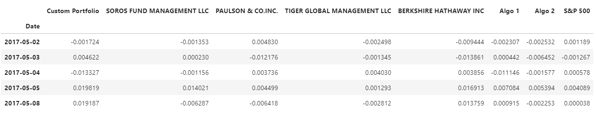
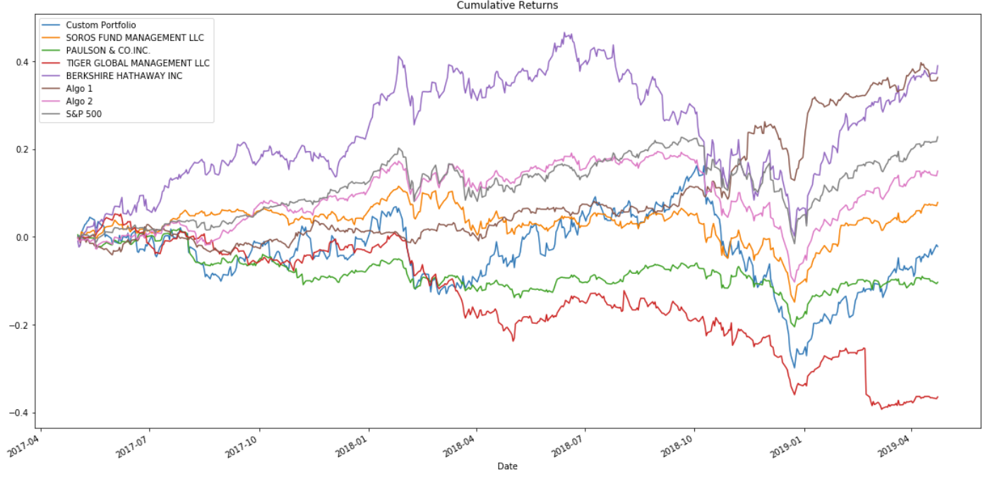
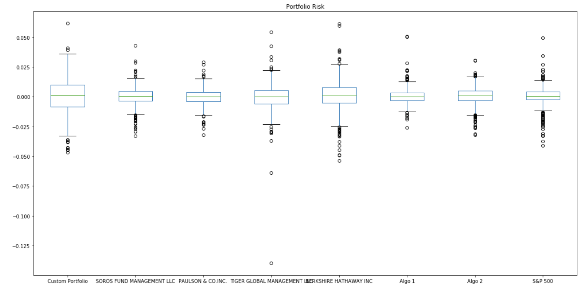
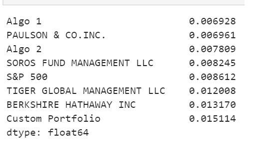
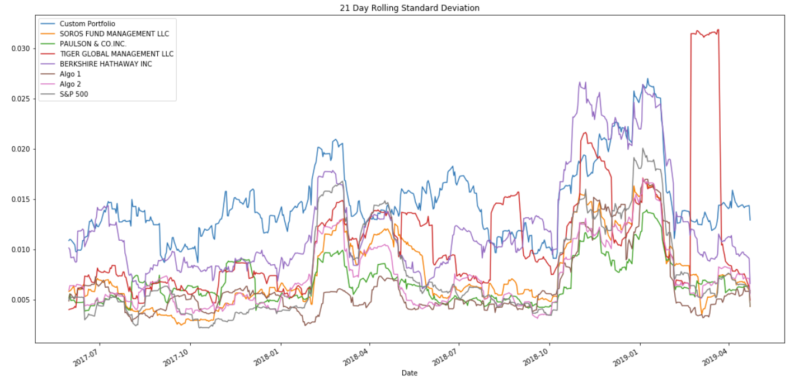
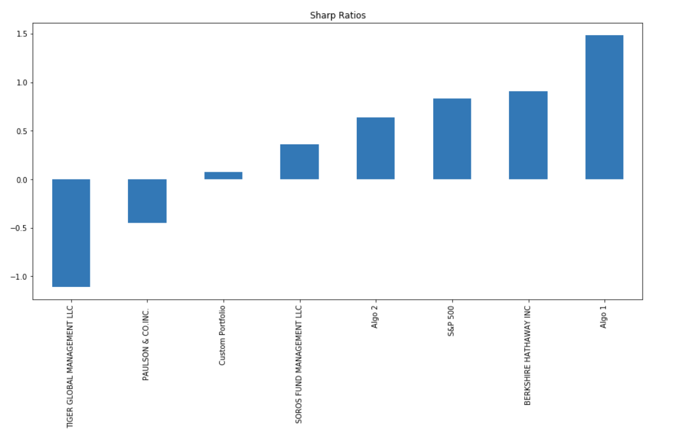

# Quantitative Portfolio Analysis
## Overview
--- 
In this jupyter notebook, I use Python and Pandas quantitative analysis tools to determine which portfolios are performing the best based on volatility, returns, risk, and Sharpe ratios. By analyzing and visualizing these major metrics, I accomplish three main tasks:
1. Read in and wrangle historical returns data from different portfolios. 
2. Determine success of each portfolio
3. Choose and evaluate custom portfolio. 

This repository contains a file with the [code](./portfolio_analysis.ipynb) I used to conduct my quantitative analysis of portfolio returns. I have also included a [Resources](./Resources) folder containing all the data files I used for the purpose of this notebook.

## Read and Clean Data 
Use Pandas to read each CSV file as a DataFrame. Then clean the data by converting dates to `DateTimeIndex`, detect and remove all null values, and convert data types as needed. Finally concatenate all DataFrames into a single DataFrame to proceed with quantitative analysis and see if any of the portfolios outperform the S&P 500

## Performance Analysis

Here we can see that Algo 1 and Berkshire Hathaway Inc have a higher cumulative return than the S&P 500. 

## Risk 

The box plot above shows that Berkshire Hathaway Inc has the biggest spread. Algo 1 has the smallest spread, but it also has some outliers. 

#### Standard Deviation

My custom portfolio has the highest volatility. 

## Rolling Statistic

The risk for the algorithmic portfolio and whale portfolio seems to move in the same direction as the S&P 500. We can also observe that Tiger Global Management LLC stock seems the most volatile based on the 21 day rolling statistic. 

## Sharp Ratios

Based on sharp ratio comparison, we can determine that algo 1 outperforms both the S&P 500 and the whales portfolios. Although Algo 2 has a lower sharp ratio than both Berkshire Hathaway Inc and the S&P 500, we can determine that the algorithmic strategies portfolios are outperforming the market and the whales portfolios. 

### Conclusion 

After conducting the quantitative analysis for different portfolios, I can conclude that the algorithmic trading strategies outperform both the S&P 500 and whale portfolios. In addition,  my portfolio didn't fair well compared to the existing portfolios. It has the highest risk based on the standard deviation, and it has a low sharp ratio. 

